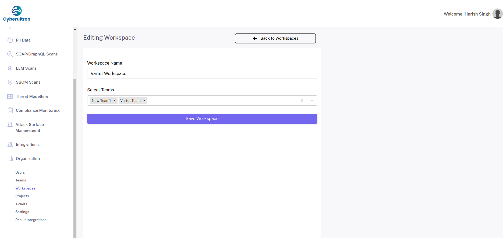

# Installation  
  
git clone <git_url>  
  
  
*Ensure Node JS Version on your machine is higher than 16.*  
  
cd backend  
npm install  
  
**Create the Required Helper Directories**  
  
```bash
mkdir security-header-scan-results security-headers-tool soap-graphql-scan-results sslyze-scan-results uploads  
cd uploads  
mkdir postman-collections sbom-files soap-and-graphql-files ticket-attachments ticket-update-attachments  
cd sbom-file  
mkdir sbom-scan-result-files  
pm2 start server.js
```

  
This will start the backend service on port 5001. You can configure the port in .env file.  

```bash  
cd ../frontend  
npm install  
npm run build
```
  
  
This will generate a build folder. Set the docroot of your frontend domain to the build folder.  
  
Install the required helper tools. You can find instructions on the below links:-  
  
  
[https://github.com/projectdiscovery/katana](https://github.com/projectdiscovery/katana)  
  
[https://github.com/devops-kung-fu/bomber](https://github.com/devops-kung-fu/bomber)  
  
[https://hub.docker.com/r/zaproxy/zap-stable](https://hub.docker.com/r/zaproxy/zap-stable)  
  
[https://github.com/nabla-c0d3/sslyze](https://github.com/nabla-c0d3/sslyze)  
  
[https://github.com/koenbuyens/securityheaders](https://github.com/koenbuyens/securityheaders)    
  
  
  
Note- The process of setting up the frontend doc root and the reverse proxy for the backend, will vary as per the environment/platform you are using.    
  
  
  
# How to Use the Application  
  
  
## Login  
  
Use the email and password provided by your system administrator to log into the application.  
  


  
## Dashboard  
  
  
After logging in, you'll be taken to a dashboard with navigation options on the left side and various charts and graphs on the right, along with organization-specific statistics.  


  
  
## Organization Management  
  
  
### Users Management  
  
If you are logged in as the primary user of the organization, you can add more users under the organization.  


  
You can add, edit or delete users.  


  
  
### Teams Management  


  
You can add, edit or delete teams under your organization. 


  
While editing a team, you can add on or more users into the team.  


  
  
### Workspaces Management  
  
You can add, edit or delete workspaces under your organization.  


  
While editing a workspace, you can give access to one or more teams to the workspace.  



  
Members of those teams will be able to access and perform actions on all projects under the workspace.  
  
  
  
### Projects Management  
  
You can add, edit or delete projects under your organization. 


While adding a project, a workspace has to be selected. The project becomes a member of the workspace.


### Tickets

This section contains tickets created as a result of vulnerabilities found in any of the scans. For each vulnerability, a ticket will be opened.


A ticket can also be opened manually.


You can follow up to a ticket by adding an update.


Tickets can be closed as RESOLVED. They can bs set into IN PROGRESS and ON HOLD statuses as well.
By default, a ticket has OPEN status. 

  
### Settings  

Under settings, you can set the severity and priority of all security test cases, as per your organization policy.

You can also select the sensitive data classes (PII Data classes) recognized by your organization policy.
  


  
### Result Integrations  
  
Under result integrations, you can save integration keys from various platforms like Slack, Trello, JIRA, Asana, Azure Boards, Teams and Discord.
  
All the scan results will be sent to these channels on completion of a scan.


  
  
## REST API Scan Framework    
  
  
1. **Adding API Collections:**    


  
  
- To scan your REST APIs for security vulnerabilities, add the API collections to the API inventory.  
  
  

  
  
- You can add API collections in Postman JSON, Postman YAML, Swagger JSON, or OpenAPI format.  
  
  
  
- You have the option to upload these as a file or provide a URL to the raw content of these collections.  
  
  
  
- When adding a collection, you can select the project to which this collection belongs.  
  
  
  
- All added collections will be displayed in a table on the API inventory page.  
  
  
  
  
  
2. **API Collection Versions:**  
  
  

  
- By default, the first collection you upload will become version 1 of that API collection.  
  
  
  
- Clicking on "View Versions" will give you a list of all versions of the API collection.  
  
      

  
- You can add more versions of the same collection, which will be listed in the same table.  
  
  
  
- You can view all scans performed on a specific collection version, view all the APIs within a collection version, start a new scan on the collection version, or delete the collection version.  
  

  
  
  
  
**Starting a Scan on a Collection Version:**  
  
  
  
  
  
1. **Scan Options:**  
  
  
  
- When starting a scan, you can select all endpoints or specific ones.  

    


  
  
- You can choose to run the scan immediately, at a specific time, or on a recurring schedule.  
  
      

  
- If you select a specific time, you'll be prompted to set the date and time.  
  
  
  
- If you choose recurring, you'll be prompted to set the recurring schedule.  
  
  
  
- Optionally, you can also select the project phase of the SDLC during which the scan is being performed.  
  
  
  
  
  
2. **Viewing Scan Results:**  
  
  
  
- You can view all performed scans under the "Scans" menu.  
  
  


  
- To see the results for a specific API collection version, use the "View Scans" option in the API collection version table.  
  

  
- By clicking on "View Report," you can see detailed information about a scan, including all vulnerabilities found and their individual explanations.  
  
  


  
  
3. **Vulnerability Details:**  
  
  
  
- Each vulnerability is displayed in a table with detailed information, including additional details in a dialog box if available, along with a description.  
  
  
  
- You can also see the remediations for that particular vulnerability type.    

  
- The cost impact for that particular vulnerability type is also displayed.  
  
  
  
- CWE and OWSP categories applicable to that vulnerability type are shown.  
  
  
  
- For record-keeping purposes, you can accept a particular vulnerability in the "Risk Acceptance" section if that vulnerability is recognized as acceptable by you.  This makes the row turn red, indicating that this vulnerability is recognized as valid.
  
  
  
  
  
## Mirroring Agents - API Traffic Scan Framework  
  
  

  
  
1. **API Traffic Scanning:**  
  
  
  
- You can scan for security vulnerabilities on the API traffic of your application during development and testing using one of the available agent options.  
  
  
  
- To do this, you need to add an application on the "Applications" page, which will generate an integration API key. You'll use this key when configuring and running the agents.  
  
  


  
- For each application, you can view a live report of all vulnerabilities found in the traffic. This also creates an inventory of APIs, which you can view under "View Inventory."  
  
  


  
- You can set the capturing status to either "Capturing" or "Stopped," based on which the agent traffic will be captured by the scanning engine.  
  
  
## SOAP/GraphQL APIs Scan Framework  
  
  
Under SOAP/GraphQL Scans , you can view the list if all scans performed.


You can also start a new scan.


You can view the result of a scan in detail, by clicking the View Report button in scans list.
  
  
## SBOM Scan Framework  
  
Under SBOM Scans , you can view the list if all scans performed.


You can also start a new scan.


You can view the result of a scan in detail, by clicking the View Report button in scans list.
  
  
## LLM Scan Framework  
  
  
Under LLM Scans , you can view the list if all scans performed.


You can also start a new scan.


You can view the result of a scan in detail, by clicking the View Report button in scans list.
  
  
  
## Attack Surface Management  
  
Under Attack Surface Scans , you can view the list if all scans performed.


You can also start a new scan on a domain.


You can view the result of a scan in detail, by clicking the View Report button in scans list.
  
  
## Alerts  
  
  
- You can view alerts generated during the scanning process under the "Alerts" section.  


  
  
  
## PII Data  
  
All PII Data (Sensitive Data Classes) found in the security scans under your account, can be seen in the PII Data section.  
  


  
  
## Threat Modelling  

Under threat modlling, you can view threat modelling of all REST API Scans and LLM Scans, by clicking on the Threat Modelling button.


  
## Compliance Monitoring  

Under compliance monitoring, you can view all compliance statuses for major compliance standards and the projects that are affected.


  
## Integrations

Under integartions, you can view/configure integartions for:

* Postman
* Burp Suite
* Jenkins
* CLI agent
* Node JS
* Python
* PHP
* Java
* .NET
* GoLang


